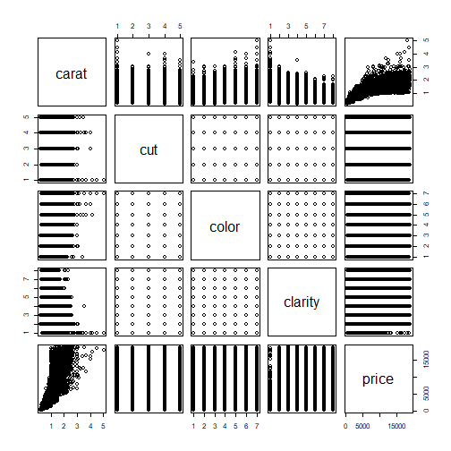

Developing Data Products - Course Project (Diamonds Dataset)
========================================================
author: Esosa Orumwese
date: 09/12/2021
autosize: true
width: 1600
height: 900

Introduction
========================================================

Did you know that apart from carat(weights), prices of diamonds are based on factors like cut, color and clarity.

- Cut: Quality of the diamond from best to worst (Ideal, Premium, Very Good, Good and Fair)
- Color: From best(D) to worst(J)
- Clarity: Measures how clear the diamond is from best to worst (IF, VVS2, VVS1, VS2, VS1, SI2, SI1, I1).


This shiny app will predict diamond price based on your input of these factors

Documentation
========================================================

Here is a summary of the "diamonds" dataset found in the ggplot2 R package. As you can see, these factors were measured in over 50,000 diamonds.


```
tibble [53,940 x 5] (S3: tbl_df/tbl/data.frame)
 $ carat  : num [1:53940] 0.23 0.21 0.23 0.29 0.31 0.24 0.24 0.26 0.22 0.23 ...
 $ cut    : Ord.factor w/ 5 levels "Fair"<"Good"<..: 5 4 2 4 2 3 3 3 1 3 ...
 $ color  : Ord.factor w/ 7 levels "D"<"E"<"F"<"G"<..: 2 2 2 6 7 7 6 5 2 5 ...
 $ clarity: Ord.factor w/ 8 levels "I1"<"SI2"<"SI1"<..: 2 3 5 4 2 6 7 3 4 5 ...
 $ price  : int [1:53940] 326 326 327 334 335 336 336 337 337 338 ...
```

Summary plot of the diamond data with each of the relevant variables plotted against each other
========================================================


Links
========================================================
- Shiny app: https://youtube.com
- source code; https://instagram.com/esosaorumwese
